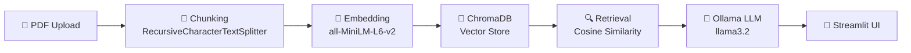

# 📄 RAG Pipeline with LangChain


A production-ready **Retrieval Augmented Generation** system that lets you upload PDF documents and ask questions about them using natural language. It chunks your PDFs, embeds them with HuggingFace sentence-transformers (free, no API key), stores vectors in ChromaDB, and generates answers with a local Ollama LLM — entirely offline, at zero API cost.

---

## Architecture



---

## Prerequisites

| Requirement | How to get it |
|---|---|
| **Python 3.10+** | [python.org](https://www.python.org/downloads/) |
| **Ollama** | [ollama.com](https://ollama.com/) |
| **llama3.2 model** | `ollama pull llama3.2` |

---

## Quickstart

```bash
# 1. Clone the repository
git clone https://github.com/<your-username>/rag-pipeline-langchain.git
cd rag-pipeline-langchain

# 2. Create a virtual environment (recommended)
python -m venv venv && source venv/bin/activate

# 3. Install dependencies
pip install -r requirements.txt

# 4. Copy and (optionally) edit the environment file
cp .env.example .env

# 5. Make sure Ollama is running with the model pulled
ollama serve &          # start the server (if not already running)
ollama pull llama3.2    # download the model

# 6. Launch the app
streamlit run app.py
```

The app will open at **http://localhost:8501**.

---

## Docker Quickstart

```bash
# Start both the app and Ollama in containers
docker compose up --build -d

# Pull the model inside the Ollama container
docker exec -it rag-ollama ollama pull llama3.2

# Open http://localhost:8501
```

To stop:

```bash
docker compose down
```

---

## Project Structure

```
rag-pipeline-langchain/
├── app.py                  # Streamlit UI — chat interface & file uploader
├── rag/
│   ├── __init__.py
│   ├── config.py           # Centralised configuration (env vars + defaults)
│   ├── ingestion.py        # PDF loading, chunking, embedding, ChromaDB storage
│   ├── retrieval.py        # Query embedding, similarity search, prompt building
│   └── llm.py              # Ollama LLM integration via langchain-ollama
├── tests/
│   ├── __init__.py
│   ├── test_ingestion.py   # Unit tests for ingestion pipeline
│   └── test_retrieval.py   # Unit tests for retrieval pipeline
├── requirements.txt
├── .env.example
├── Dockerfile
├── docker-compose.yml
├── Makefile
├── LICENSE
└── README.md
```

---

## How It Works

| Step | What happens |
|---|---|
| **1. Ingest** | PDFs are loaded with PyMuPDF, split into overlapping 1 000-character chunks, embedded with `all-MiniLM-L6-v2`, and stored in ChromaDB on disk. |
| **2. Query** | Your question is embedded with the same model and compared against stored chunks via cosine similarity. |
| **3. Retrieve** | The top-K most relevant chunks are assembled into a context block with source attribution. |
| **4. Generate** | The context + question are sent to Ollama (llama3.2) which produces a grounded answer. |

---

## Configuration

All settings are loaded from environment variables (or a `.env` file) with sensible defaults.

| Variable | Default | Description |
|---|---|---|
| `OLLAMA_BASE_URL` | `http://localhost:11434` | Ollama server URL |
| `OLLAMA_MODEL` | `llama3.2` | Ollama model name |
| `OLLAMA_TEMPERATURE` | `0.3` | LLM sampling temperature |
| `CHROMA_PERSIST_DIR` | `./chroma_db` | ChromaDB storage directory |
| `CHROMA_COLLECTION` | `rag_documents` | ChromaDB collection name |
| `EMBEDDING_MODEL_NAME` | `sentence-transformers/all-MiniLM-L6-v2` | HuggingFace embedding model |
| `CHUNK_SIZE` | `1000` | Characters per chunk |
| `CHUNK_OVERLAP` | `200` | Overlap between chunks |
| `TOP_K` | `5` | Number of chunks to retrieve |
| `UPLOAD_DIR` | `./uploaded_pdfs` | Temp directory for uploads |

---

## Tech Stack

| Tool | Purpose | Version |
|---|---|---|
| [Streamlit](https://streamlit.io) | Web UI | ≥ 1.38 |
| [LangChain](https://langchain.com) | Orchestration & text splitting | ≥ 0.3 |
| [ChromaDB](https://www.trychroma.com) | Vector database | ≥ 0.5 |
| [Sentence-Transformers](https://sbert.net) | Free embedding model | ≥ 3.0 |
| [PyMuPDF](https://pymupdf.readthedocs.io) | PDF text extraction | ≥ 1.24 |
| [Ollama](https://ollama.com) | Local LLM inference | latest |
| [Docker](https://www.docker.com) | Containerisation | latest |

---

## Running Tests

```bash
# Using make
make test

# Or directly
pytest tests/ -v
```

---

## Contributing

Contributions are welcome! Please:

1. Fork the repository.
2. Create a feature branch (`git checkout -b feature/amazing-feature`).
3. Commit your changes (`git commit -m 'Add amazing feature'`).
4. Push to the branch (`git push origin feature/amazing-feature`).
5. Open a Pull Request.

---

## License

Distributed under the **MIT License**. See [LICENSE](LICENSE) for details.

---

> **Resume bullet:** Built production RAG pipeline processing PDF documents with LangChain + ChromaDB + HuggingFace embeddings, enabling semantic Q&A with zero API cost using local Ollama LLM
